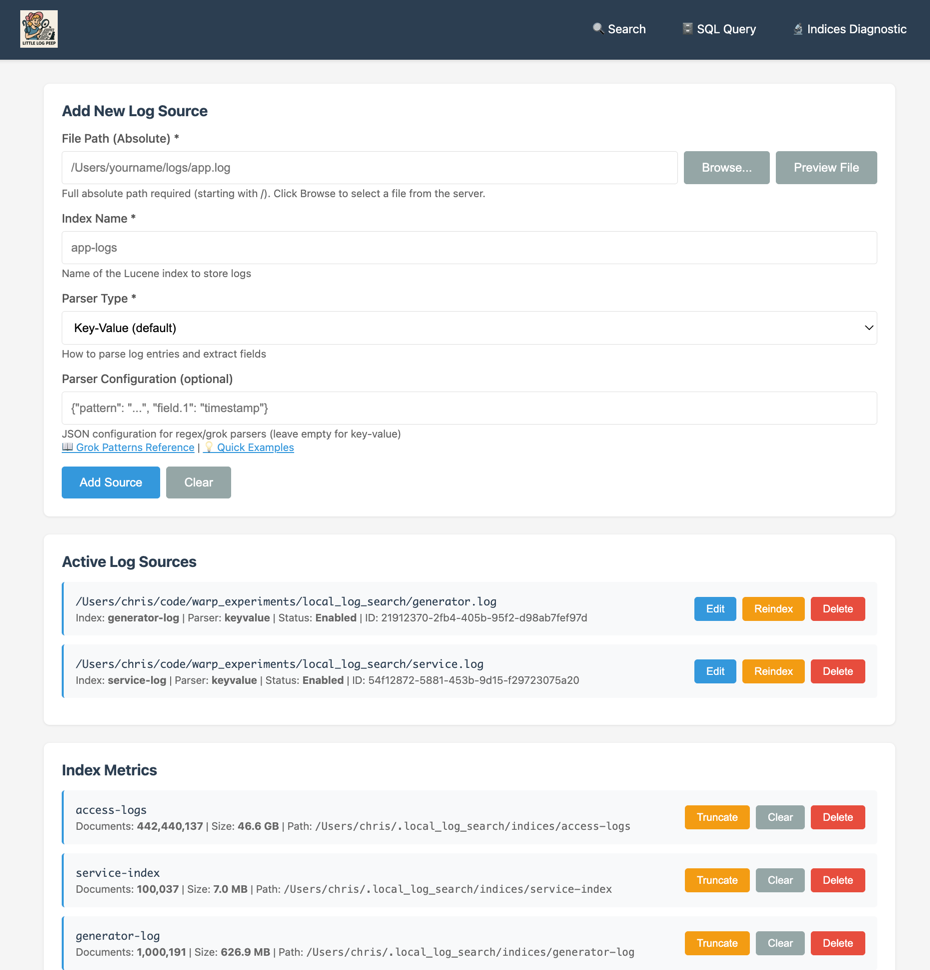
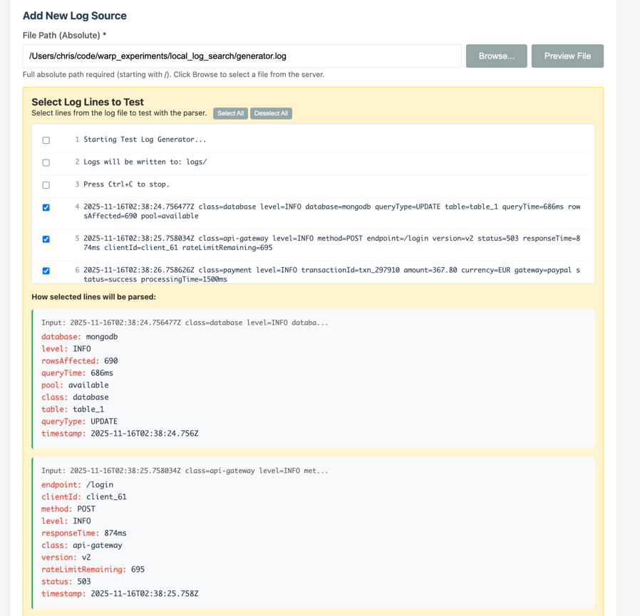
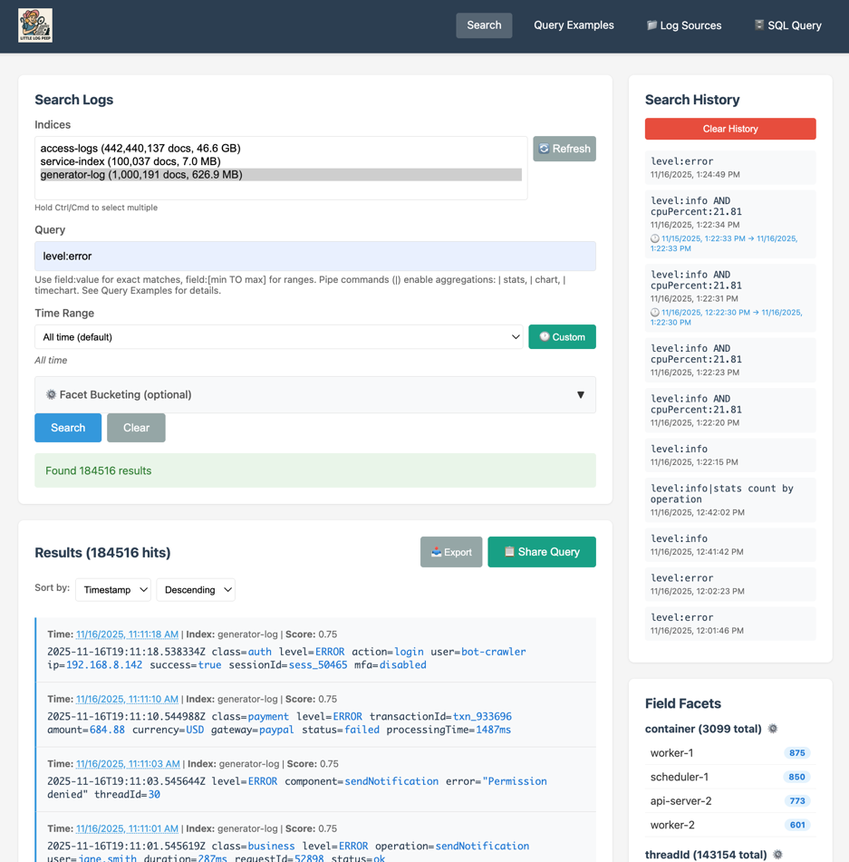
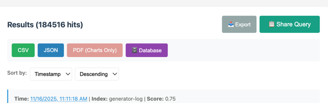
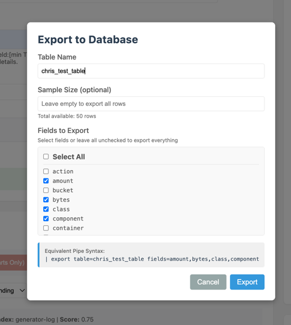
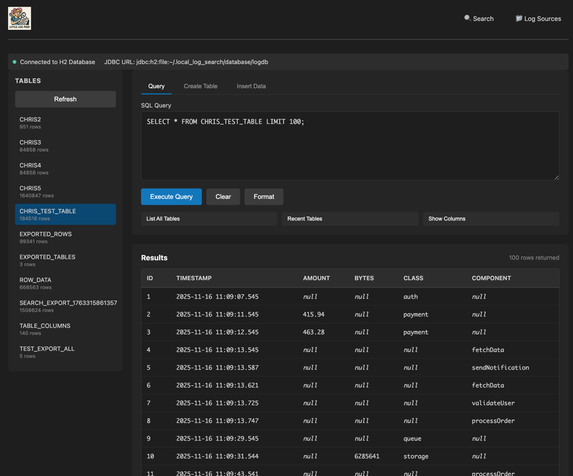
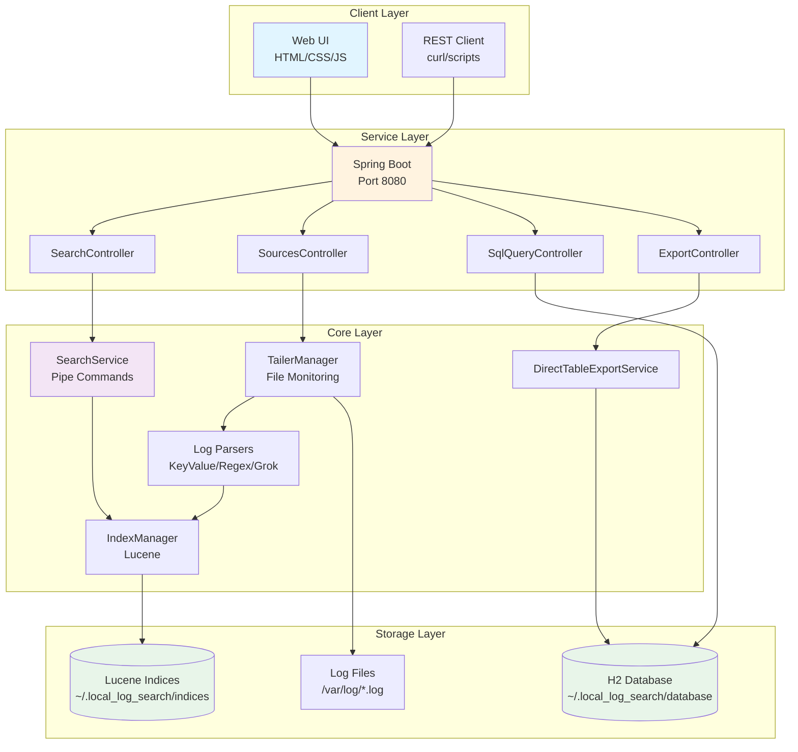
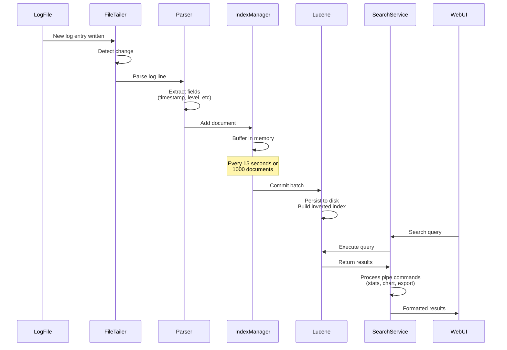
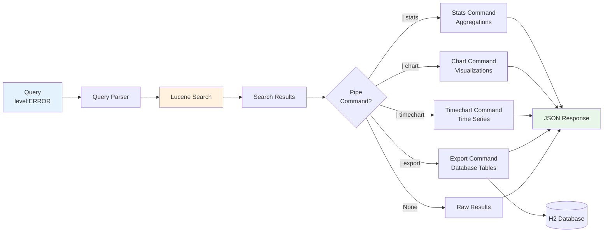

# Little Log Peep


**A powerful local log search and analysis tool built with Java, Lucene, and Spring Boot.**

Perfect for developers who need to debug logs locally without enterprise logging infrastructure. Think Splunk-like capabilities running entirely on your machine.

---

## 📋 Table of Contents

- [Features](#-features)
- [Quick Start](#-quick-start)
- [Architecture](#-architecture)
- [Using the Application](#-using-the-application)
  - [Web UI](#web-ui)
  - [Search Syntax](#search-syntax)
  - [Faceted Search](#faceted-search)
  - [SQL Query Interface](#sql-query-interface)
  - [Database Export](#database-export)
  - [REST API](#rest-api)
- [Log Generator](#-log-generator)
- [Parser Types](#-parser-types)
- [Performance Tuning](#-performance-tuning)
- [Troubleshooting](#-troubleshooting)
- [License](#-license)


The index source management UI.  This UI lets you browse for log files, configure the parser, and monitor the index. The preview mode lets you cherry pick some log entries to then validate that the parser is parsing fields out of the logs properly.



The searh UI lets you query your logs.  You can search one or more indices.  Search results can be ordered by time or other factors.  The results include facets down the right of the UI that shows frequency breakdown of relevant fields.  You can refine your search from either the facets or from the highlighted values in the search result itself.
The search UI supports constraining by time in a variety of ways.  You can select a time range, or you can use the interactive time selector to zoom in on a specific time period.  The interactive time selector also lets you select a date range, which is useful for when you want to see the distribution of logs over a period of time.
Search supports a "pipe" mechanism that lets you chain together multiple operations on the search results.  For example, you can aggregate the results by a field, or you can create a time chart of the results.  The pipe mechanism is very powerful and lets you do a lot of interesting things with your search results.



results can be exported to CSV, JSON, or PDF.  The CSV export supports exporting only a subset of the fields in the search results.  The JSON export supports exporting only a subset of the fields in the search results, and includes a link to the full log entry in the JSON object.  The PDF export supports exporting only a subset of the fields in the search results.  Also can be exported to a local database.




For exports to the database we provide a simple SQL interface that lets you query the exported tables.




---

## ✨ Features

### Core Capabilities
- **Real-time Log Tailing** - Monitor multiple log files simultaneously with automatic detection of new entries
- **Powerful Lucene Search** - Full-text search with field queries, wildcards, ranges, and boolean operators
- **Multiple Index Support** - Organize logs into separate indices for different sources or applications
- **Flexible Parsing** - Support for key=value, regex, Grok patterns, and custom Java parsers
- **Automatic Timestamp Detection** - Recognizes common timestamp formats and indexes time-based data

### Advanced Features
- **Splunk-style Pipe Commands** - Chain commands for aggregations (`stats`), charts (`chart`, `timechart`), and exports
- **Faceted Search** - Bucketed aggregations for duration, response time, and custom numeric fields
- **Interactive Time Selection** - Click and drag on charts to zoom into specific time ranges
- **Database Export** - Export search results to H2 database tables for later SQL analysis
- **SQL Query UI** - Web-based interface for direct SQL queries against exported data
- **Query Sharing** - Generate shareable URLs and cURL commands for collaboration
- **Live Preview** - Test log parsers with real-time preview before configuring sources

### User Interface
- **Modern Web UI** - Clean, responsive interface with dark mode support
- **Multiple Views** - Search, Query Examples, Log Sources configuration, SQL Query interface
- **Real-time Charts** - Bar charts, pie charts, and time-series visualizations
- **Export Options** - CSV, JSON, PDF (for charts), and database table exports
- **Visual Time Picker** - Quick time range selection with presets (last hour, 24h, 7d, custom)

---

## 🚀 Quick Start

### Prerequisites

- Java 21 or later (OpenJDK or Amazon Corretto)
- Maven 3.6+

### Build

```bash
cd /Users/chris/code/warp_experiments/local_log_search
mvn clean package
```

### Start the Application

**Option 1: Demo Script (Recommended)**

```bash
./start-demo.sh
```

This starts:
- Log generator creating test data
- Search service on port 8080
- Automatically configured log sources

**Option 2: Manual Start**

```bash
# Start log generator
java -jar test-log-generator/target/test-log-generator-1.0-SNAPSHOT-jar-with-dependencies.jar &

# Start search service
cd log-search-service
java -jar target/log-search-service-1.0-SNAPSHOT.jar
```

### Access the Application

Open your browser to: **http://localhost:8080/ui/index.html**

---

## 🏗️ Architecture

### System Overview



### Data Flow



### Pipe Command Processing



### Modules

```
local_log_search/
├── log-search-core/          # Core functionality
│   ├── index/               # Lucene indexing (IndexManager)
│   ├── parser/              # Log parsers (KeyValue, Regex, Grok)
│   ├── search/              # Search service with pipe commands
│   ├── tailer/              # File tailing (FileTailer, TailerManager)
│   └── pipe/                # Pipe command framework
│
├── log-search-service/      # Spring Boot web service
│   ├── controller/          # REST API controllers
│   ├── export/              # Database export service
│   └── resources/static/ui/ # Web UI (HTML/CSS/JS)
│
└── test-log-generator/      # Test log generator
    └── TestLogGenerator.java
```

### Key Components

**FileTailer**: Monitors log files for new content (like `tail -f`), handles file rotation, maintains state across restarts

**LogParser**: Pluggable parser framework supporting:
- KeyValueParser - Extracts `key=value` pairs
- RegexParser - Custom regular expressions
- GrokParser - Logstash-compatible Grok patterns
- Custom parsers via Java interface

**IndexManager**: Manages Lucene indices with configurable commit intervals, handles multiple indices, automatic field detection

**SearchService**: Query interface with pipe command support for aggregations, charts, and exports

**PipeCommand**: Framework for chaining operations on search results (stats, chart, timechart, export)

**REST Controllers**: API endpoints for sources management, search, indices, SQL queries, and exports

---

## 💻 Using the Application

### Web UI

#### Search Page

The main search interface provides:

1. **Index Selection** - Multi-select dropdown with document counts and sizes
2. **Query Input** - Lucene query syntax with pipe commands
3. **Time Range** - Quick presets (last 5m, 1h, 24h, 7d) or custom ranges
4. **Facet Bucketing** - Configure bucketed aggregations for numeric fields
5. **Results Display** - Paginated results with field highlighting
6. **Export Options** - CSV, JSON, PDF, or database table export

**Quick Time Presets:**
- Last 5 minutes
- Last 15 minutes
- Last 30 minutes
- Last 1 hour, 2 hours, 4 hours, 12 hours
- Last 24 hours
- Last 7 days, 30 days

#### Log Sources Page

Configure which log files to monitor:

1. **Add New Source** - Specify file path, index name, and parser type
2. **File Browser** - Browse server filesystem to select log files
3. **Live Preview** - Select log lines and test parser configurations
4. **Active Sources** - View and manage existing log sources
5. **Index Metrics** - Monitor document counts and index sizes

### Search Syntax

#### Basic Queries

```
ERROR                           # Search for "ERROR" in any field
level:ERROR                     # Search for ERROR in the level field
user:john*                      # Wildcard search
duration:[100 TO 500]           # Range query (100-500 inclusive)
timestamp:[2025-01-14 TO 2025-01-15]  # Time range
```

#### Boolean Operators

```
ERROR AND database              # Both terms must be present
ERROR OR WARN                   # Either term must be present
ERROR NOT connection            # ERROR but not connection
level:ERROR AND user:admin      # Combined field queries
(level:ERROR OR level:WARN) AND user:admin  # Grouped queries
```

#### Advanced

```
"exact phrase"                  # Phrase search
raw_text:"connection timeout"   # Search in raw log text
level:ERROR AND duration:[* TO 1000]  # Unbounded range
```

### Faceted Search

Configure bucketed aggregations for numeric fields to categorize results:

**Example: Duration Buckets**

Configure buckets: `0, 100, 500, 1000, 5000`

Results are categorized:
- 0-100ms: Fast responses
- 100-500ms: Normal responses
- 500-1000ms: Slow responses
- 1000-5000ms: Very slow responses
- 5000+ms: Timeouts

**Usage:**

1. Click "⚙️ Facet Bucketing" in the search form
2. Enter field name (e.g., `duration`)
3. Enter comma-separated ranges (e.g., `0,100,500,1000,5000`)
4. Click "+ Add"
5. Run your search

Results show facet counts for each bucket, allowing you to quickly identify distribution patterns.

### Pipe Commands

Chain operations to process search results:

#### Stats Command

Aggregate data with various functions:

```
level:ERROR | stats count
level:ERROR | stats count by user
level:ERROR | stats count avg(duration) by operation
status:slow | stats min(duration) max(duration) avg(duration) by user
* | stats dc(user) dc(operation) by level
```

**Functions:**
- `count` - Count of results
- `sum(field)` - Sum of numeric values
- `avg(field)` - Average of numeric values
- `min(field)` - Minimum value
- `max(field)` - Maximum value
- `dc(field)` - Distinct count

#### Chart Command

Visualize aggregated data:

```
level:ERROR | chart count by user
level:ERROR | chart type=pie count by operation
status:slow | chart type=bar avg(duration) by operation
* | chart type=line count by level
```

**Chart Types:**
- `type=bar` - Bar chart (default)
- `type=pie` - Pie chart
- `type=line` - Line chart

#### Timechart Command

Create time-series visualizations:

```
* | timechart span=1h count
level:ERROR | timechart span=5m count
level:ERROR | timechart span=30m count by user
(level:ERROR OR level:WARN) | timechart span=15m count by level
```

**Time Spans:**
- `span=Ns` - N seconds (e.g., `span=30s`)
- `span=Nm` - N minutes (e.g., `span=5m`)
- `span=Nh` - N hours (e.g., `span=1h`)
- `span=Nd` - N days (e.g., `span=1d`)

**Interactive Time Selection:**

1. Run a timechart query
2. Click and drag on the chart to zoom into a time range
3. Date filters update automatically
4. Click "Search" to see detailed logs from that period
5. Double-click chart to reset zoom

### SQL Query Interface

Access the SQL UI at: **http://localhost:8080/ui/sql.html**

#### Features

- **Query Tab** - Execute SELECT queries, view results in formatted tables
- **Create Table Tab** - Visual interface for creating custom tables
- **Insert Data Tab** - Execute INSERT statements
- **Tables Sidebar** - Browse all tables with row counts

#### Common Queries

```sql
-- View all exported tables
SELECT * FROM exported_tables;

-- Query exported log data
SELECT * FROM error_logs LIMIT 100;

-- Aggregate analysis
SELECT operation, COUNT(*) as error_count
FROM error_logs
GROUP BY operation
ORDER BY error_count DESC;

-- Time-based analysis
SELECT DATE(timestamp) as date, COUNT(*) as errors
FROM error_logs
GROUP BY DATE(timestamp)
ORDER BY date;
```

#### H2 Console

Alternative access via built-in H2 console: **http://localhost:8080/h2-console**

**Connection:**
- JDBC URL: `jdbc:h2:file:~/.local_log_search/database/logdb`
- Username: `sa`
- Password: (empty)

### Database Export

Export search results to database tables for later SQL analysis.

#### Pipe Command Syntax

```
<query> | export table=<name> [fields=<columns>] [sample=<N>]
```

**Examples:**

```
# Export all error logs
level:ERROR | export table=error_logs

# Export specific fields with sampling
level:ERROR | export table=error_sample fields=timestamp,user,operation,message sample=1000

# Export slow operations
status:slow | export table=slow_ops fields=timestamp,operation,duration,user
```

**Parameters:**
- `table` (required) - Table name to create
- `fields` (optional) - Comma-separated field list (default: all)
- `sample` (optional) - Max rows to export (default: all)

#### Export UI

Click the "🗄️ Database" button in the export menu:

1. Enter table name (auto-suggested with timestamp)
2. Select fields to export using checkboxes
3. Enter sample size (optional)
4. Preview pipe syntax in real-time
5. Click "Export"

Success message includes:
- Table name and row count
- List of exported columns
- Link to SQL UI
- Sample query

#### REST API

```bash
POST /api/export/results
Content-Type: application/json

{
  "indices": ["app-logs"],
  "query": "level:ERROR",
  "tableName": "error_logs",
  "fields": ["timestamp", "user", "operation", "message"],
  "sampleSize": 1000
}
```

### REST API

#### Search Logs (Basic)

```bash
POST /api/search
Content-Type: application/json

{
  "indices": ["app-logs"],
  "query": "level:ERROR AND user:admin",
  "page": 0,
  "pageSize": 50,
  "sortField": "timestamp",
  "sortDescending": true,
  "timestampFrom": 1704067200000,
  "timestampTo": 1704153600000,
  "facetBuckets": {
    "duration": {
      "ranges": [0, 100, 500, 1000, 5000]
    }
  }
}
```

#### Search with Stats Aggregation

```bash
POST /api/search
Content-Type: application/json

{
  "indices": ["app-logs"],
  "query": "level:ERROR | stats count avg(duration) by operation"
}
```

Response:
```json
{
  "resultType": "PIPE_RESULT",
  "pipeResult": {
    "type": "stats",
    "rows": [
      {"operation": "processOrder", "count": 1523, "avg(duration)": 345.2},
      {"operation": "updateInventory", "count": 892, "avg(duration)": 123.5}
    ],
    "columns": ["operation", "count", "avg(duration)"]
  }
}
```

#### Search with Chart

```bash
POST /api/search
Content-Type: application/json

{
  "indices": ["app-logs"],
  "query": "level:ERROR | chart type=bar count by operation"
}
```

Response:
```json
{
  "resultType": "PIPE_RESULT",
  "pipeResult": {
    "type": "chart",
    "chartType": "bar",
    "labels": ["processOrder", "updateInventory", "validatePayment"],
    "datasets": [
      {
        "label": "count",
        "data": [1523, 892, 456]
      }
    ]
  }
}
```

#### Search with Timechart

```bash
POST /api/search
Content-Type: application/json

{
  "indices": ["app-logs"],
  "query": "level:ERROR | timechart span=1h count by level"
}
```

Response:
```json
{
  "resultType": "PIPE_RESULT",
  "pipeResult": {
    "type": "timechart",
    "chartType": "line",
    "labels": ["2025-01-14T00:00:00Z", "2025-01-14T01:00:00Z", "2025-01-14T02:00:00Z"],
    "datasets": [
      {
        "label": "ERROR",
        "data": [145, 203, 178]
      },
      {
        "label": "WARN",
        "data": [89, 112, 95]
      }
    ]
  }
}
```

#### Export to Database via API

```bash
POST /api/export/results
Content-Type: application/json

{
  "indices": ["app-logs"],
  "query": "level:ERROR",
  "tableName": "error_logs_2025_01",
  "fields": ["timestamp", "user", "operation", "message", "duration"],
  "sampleSize": 5000,
  "timestampFrom": 1704067200000,
  "timestampTo": 1704153600000
}
```

Response:
```json
{
  "tableName": "error_logs_2025_01",
  "rowsExported": 5000,
  "totalRows": 15234,
  "columns": ["timestamp", "user", "operation", "message", "duration"]
}
```

#### List Indices

```bash
GET /api/indices
```

Response:
```json
[
  {
    "name": "app-logs",
    "path": "/Users/chris/.local_log_search/indices/app-logs",
    "documentCount": 330057408,
    "sizeFormatted": "58.8 GB",
    "sizeBytes": 63088097914
  }
]
```

#### Add Log Source

```bash
POST /api/sources
Content-Type: application/json

{
  "filePath": "/path/to/logs/application.log",
  "indexName": "app-logs",
  "parserType": "keyvalue",
  "enabled": true
}
```

#### List Log Sources

```bash
GET /api/sources
```

#### Execute SQL Query

```bash
POST /api/sql/query
Content-Type: application/json

{
  "sql": "SELECT * FROM exported_tables"
}
```

---

## 🎲 Log Generator

The included test log generator creates realistic log data for testing and demos.

### Basic Usage

```bash
# Generate logs continuously (until Ctrl+C)
java -jar test-log-generator/target/test-log-generator-1.0-SNAPSHOT-jar-with-dependencies.jar

# Generate specific number of logs
java -jar test-log-generator/target/test-log-generator-1.0-SNAPSHOT-jar-with-dependencies.jar --max-logs 10000

# Slow generation (1 log per second)
java -jar test-log-generator/target/test-log-generator-1.0-SNAPSHOT-jar-with-dependencies.jar --delay 1000
```

### Historical Logs

```bash
# Last 7 days
java -jar test-log-generator/target/test-log-generator-1.0-SNAPSHOT-jar-with-dependencies.jar \
  --days-back 7 \
  --max-logs 10000

# Specific start date
java -jar test-log-generator/target/test-log-generator-1.0-SNAPSHOT-jar-with-dependencies.jar \
  --start-date 2025-01-01T00:00:00Z \
  --max-logs 5000
```

### Helper Scripts

```bash
# Generate historical test data
./generate-historical-logs.sh

# Start complete demo (generator + service)
./start-demo.sh

# Stop all services
./stop-demo.sh
```

### Generated Log Classes

The generator creates 11 different log classes:

- **Payment** - Payment processing logs
- **Authentication** - Login/logout events
- **Database** - DB query performance
- **Billing** - Billing operations
- **Notification** - Email/SMS notifications
- **Analytics** - Analytics processing
- **Cache** - Cache operations
- **Report** - Report generation
- **Import** - Data imports
- **Export** - Data exports
- **Validation** - Data validation

### Output Files

```
logs/
├── application.log   # All 11 log classes mixed
├── access.log        # HTTP access logs
└── error.log         # Error bursts
```

### Viewing Generated Logs

```bash
# Follow logs in real-time
tail -f logs/application.log

# View last 20 lines
tail -20 logs/application.log

# Search for specific content
grep "class:payment" logs/application.log

# Count total lines
wc -l logs/application.log
```

---

## 🔧 Parser Types

### 1. Key-Value Parser (Default)

Automatically extracts `key=value` pairs.

**Example log:**
```
2025-01-14T10:30:00Z level=ERROR operation=processOrder user=john.doe duration=450ms
```

**Configuration:**
```json
{
  "parserType": "keyvalue"
}
```

**Extracted fields:** `level`, `operation`, `user`, `duration`

### 2. Regex Parser

Uses regular expressions to extract fields.

**Configuration:**
```json
{
  "parserType": "regex",
  "parserConfig": {
    "pattern": "(\\d{4}-\\d{2}-\\d{2}T\\d{2}:\\d{2}:\\d{2}Z) \\[(\\w+)\\] (.*)",
    "field.1": "timestamp",
    "field.2": "level",
    "field.3": "message",
    "timestamp.group": "1"
  }
}
```

### 3. Grok Parser

Uses Grok patterns (like Logstash).

**Configuration:**
```json
{
  "parserType": "grok",
  "parserConfig": {
    "pattern": "%{TIMESTAMP_ISO8601:timestamp} %{LOGLEVEL:level} %{GREEDYDATA:message}",
    "timestamp.field": "timestamp"
  }
}
```

### 4. Custom Parser

Implement your own parser by extending `LogParser` interface.

**Configuration:**
```json
{
  "parserType": "custom",
  "parserConfig": {
    "class": "com.example.MyCustomParser"
  }
}
```

---

## ⚡ Performance Tuning

### Configuration

Edit `log-search-service/src/main/resources/application.properties`:

```properties
# Server configuration
server.port=8080

# Index configuration
index.base-directory=${user.home}/.local_log_search/indices
index.commit-interval-seconds=15
index.max-buffered-docs=1000

# Logging
logging.level.com.locallogsearch=INFO
```

### Commit Interval

- **Lower (5-10s)** - More real-time search, higher I/O
- **Higher (30-60s)** - Better indexing performance, less real-time

### Max Buffered Documents

- **Lower (100-500)** - Less memory, more frequent commits
- **Higher (1000-5000)** - Better bulk indexing performance

### Multiple Indices

Use separate indices for different log types:
- Improved search performance
- Different retention policies
- Logical organization

---

## 🔍 Troubleshooting

### Logs Not Being Indexed

1. Check file permissions on log files
2. Verify file path in log source configuration
3. Check service logs: `tail -f log-search-service/service.log`
4. Ensure commit interval has passed (default 15s)

### Search Returns No Results

1. Wait for commit interval to pass
2. Check index name matches configured source
3. Verify query syntax (Lucene doesn't allow `*` as standalone query)
4. Check if log files have content

### Indices Not Showing in Dropdown

1. Hard refresh browser (Cmd+Shift+R or Ctrl+Shift+F5)
2. Check browser console for JavaScript errors
3. Verify `/api/indices` endpoint returns data
4. Try diagnostic page: http://localhost:8080/ui/test-indices.html

### High Memory Usage

1. Reduce `index.max-buffered-docs`
2. Increase `index.commit-interval-seconds`
3. Use multiple smaller indices

### Service Won't Start

1. Check port 8080 is not in use: `lsof -i :8080`
2. Verify Java version: `java -version` (requires Java 21+)
3. Check for errors in `service.log`

---

## 📄 License

MIT License

Copyright (c) 2025 Chris Collins

Permission is hereby granted, free of charge, to any person obtaining a copy
of this software and associated documentation files (the "Software"), to deal
in the Software without restriction, including without limitation the rights
to use, copy, modify, merge, publish, distribute, sublicense, and/or sell
copies of the Software, and to permit persons to whom the Software is
furnished to do so, subject to the following conditions:

The above copyright notice and this permission notice shall be included in all
copies or substantial portions of the Software.

THE SOFTWARE IS PROVIDED "AS IS", WITHOUT WARRANTY OF ANY KIND, EXPRESS OR
IMPLIED, INCLUDING BUT NOT LIMITED TO THE WARRANTIES OF MERCHANTABILITY,
FITNESS FOR A PARTICULAR PURPOSE AND NONINFRINGEMENT. IN NO EVENT SHALL THE
AUTHORS OR COPYRIGHT HOLDERS BE LIABLE FOR ANY CLAIM, DAMAGES OR OTHER
LIABILITY, WHETHER IN AN ACTION OF CONTRACT, TORT OR OTHERWISE, ARISING FROM,
OUT OF OR IN CONNECTION WITH THE SOFTWARE OR THE USE OR OTHER DEALINGS IN THE
SOFTWARE.

See the [LICENSE](LICENSE) file for full details.

---

**Built with ❤️ for developers who love their logs**
