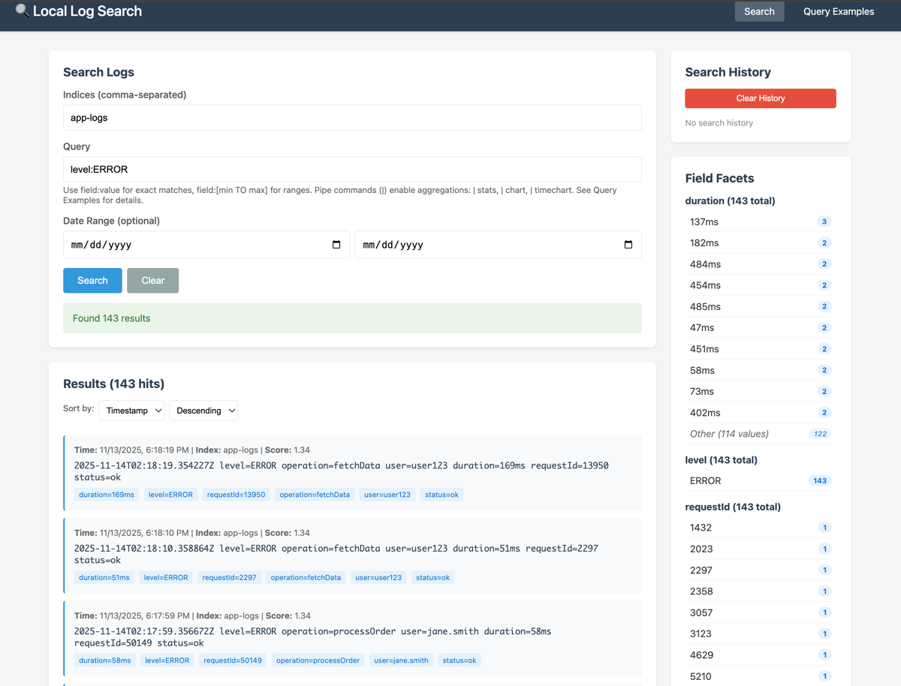
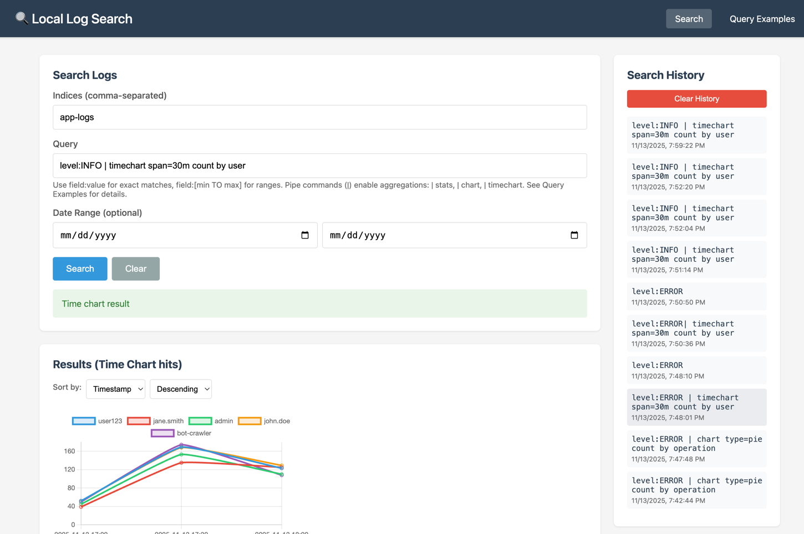
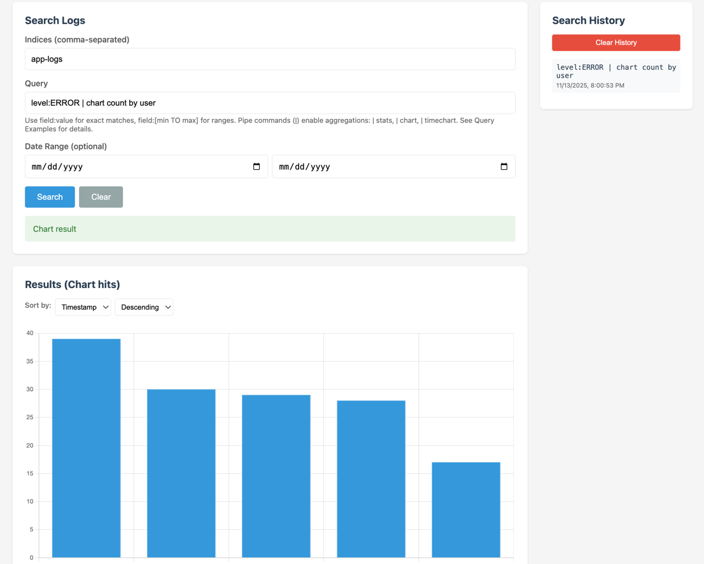
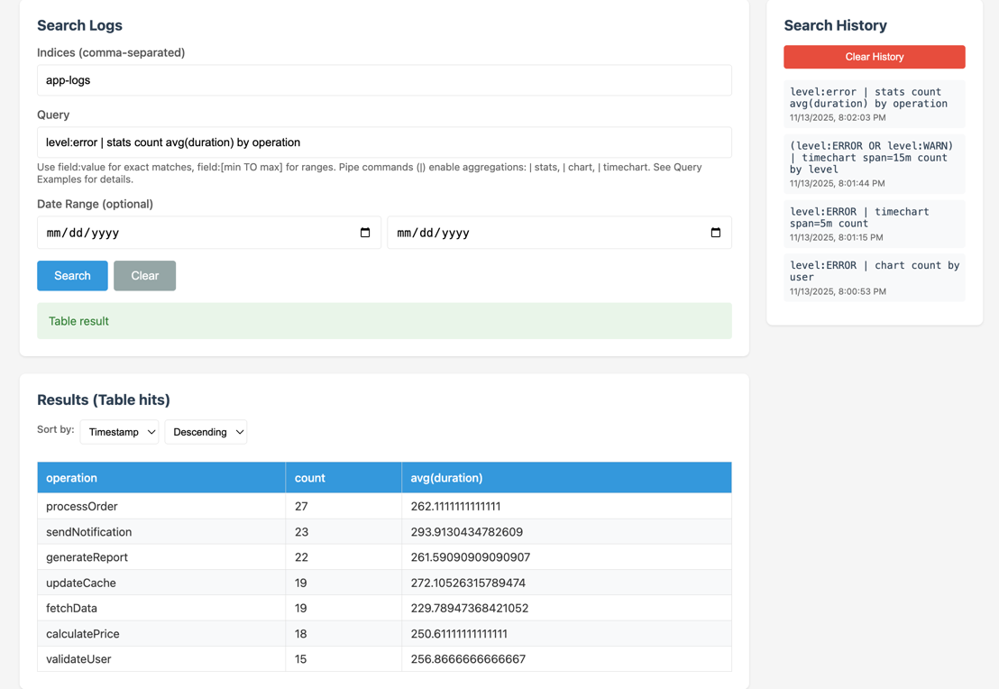

# Local Log Search

A local log search and indexing service similar to Splunk, built with Java, Lucene, Spring Boot, and Vaadin Flow. Perfect for developers who need to debug logs locally without a full enterprise logging stack.

## Features

- **Real-time Log Tailing**: Monitor multiple log files simultaneously with configurable parsing
- **Powerful Search**: Lucene-based full-text search with field queries
- **Multiple Index Support**: Separate indices for different log sources
- **Flexible Parsing**: Support for key=value, regex, Grok patterns, and custom Java parsers
- **Automatic Timestamp Detection**: Recognizes common timestamp formats
- **Web UI**: Vaadin Flow-based interface for managing sources and searching
- **REST API**: Programmatic access to all functionality
- **Configurable Commits**: Control indexing performance with commit intervals








## Architecture

### Modules

- **log-search-core**: Core functionality (tailing, parsing, indexing, search)
- **log-search-service**: Spring Boot service with REST API and Vaadin UI
- **test-log-generator**: Test application that generates sample logs

### Components

- **FileTailer**: Monitors log files for new content (similar to `tail -f`)
- **LogParser**: Pluggable parser framework with multiple implementations
- **IndexManager**: Manages Lucene indices with configurable commit points
- **SearchService**: Query interface supporting multiple indices
- **REST Controllers**: API endpoints for sources and search
- **Vaadin UI**: Web interface for configuration and search

## Quick Start

### Prerequisites

- Java 21 or later (OpenJDK or Amazon Corretto)
- Maven 3.6+

### Build

```bash
mvn clean package
```

### Run Test Log Generator

First, generate some test logs:

```bash
cd test-log-generator
mkdir -p logs
java -jar target/test-log-generator-1.0-SNAPSHOT.jar
```

This will create three log files in `logs/`:
- `application.log` - Mixed format with key=value pairs
- `access.log` - HTTP access logs
- `error.log` - Error logs with bursts

Leave this running in a separate terminal.

### Run the Service

```bash
cd log-search-service
java -jar target/log-search-service-1.0-SNAPSHOT.jar
```

The service will start on `http://localhost:8080`

## Configuration

Edit `log-search-service/src/main/resources/application.properties`:

```properties
# Server configuration
server.port=8080

# Index configuration
index.base-directory=${user.home}/.local_log_search/indices
index.commit-interval-seconds=15
index.max-buffered-docs=1000

# Logging
logging.level.com.locallogsearch=INFO
```

## Usage

### Web UI

1. **Open your browser**: Navigate to `http://localhost:8080`

2. **Add Log Sources**:
   - Click "Log Sources" in the sidebar
   - Click "Add Log Source"
   - Enter:
     - File Path: `/path/to/your/logfile.log`
     - Index Name: `logs` (or custom name)
     - Parser Type: `keyvalue` (default)
   - Click "Save"

3. **Search Logs**:
   - Click "Search" in the sidebar
   - Enter index name(s): `logs`
   - Enter query: `ERROR` or `level=ERROR` or `user=john.doe`
   - Click "Search"

### REST API

#### Add a Log Source

```bash
curl -X POST http://localhost:8080/api/sources \
  -H "Content-Type: application/json" \
  -d '{
    "filePath": "/path/to/logs/application.log",
    "indexName": "app-logs",
    "parserType": "keyvalue",
    "enabled": true
  }'
```

#### List All Sources

```bash
curl http://localhost:8080/api/sources
```

#### Search Logs

```bash
curl -X POST http://localhost:8080/api/search \
  -H "Content-Type: application/json" \
  -d '{
    "indices": ["app-logs"],
    "query": "ERROR",
    "maxResults": 100
  }'
```

#### Search with Field Queries

```bash
curl -X POST http://localhost:8080/api/search \
  -H "Content-Type: application/json" \
  -d '{
    "indices": ["app-logs"],
    "query": "level:ERROR AND user:admin",
    "maxResults": 50
  }'
```

## Parser Types

### 1. Key-Value Parser (Default)

Automatically extracts `key=value` pairs from log entries.

**Example log:**
```
2025-01-14T10:30:00Z level=ERROR operation=processOrder user=john.doe duration=450ms
```

**Configuration:**
```json
{
  "parserType": "keyvalue"
}
```

**Extracted fields:** `level`, `operation`, `user`, `duration`

### 2. Regex Parser

Uses regular expressions to extract fields.

**Configuration:**
```json
{
  "parserType": "regex",
  "parserConfig": {
    "pattern": "(\\d{4}-\\d{2}-\\d{2}T\\d{2}:\\d{2}:\\d{2}Z) \\[(\\w+)\\] (.*)",
    "field.1": "timestamp",
    "field.2": "level",
    "field.3": "message",
    "timestamp.group": "1"
  }
}
```

### 3. Grok Parser

Uses Grok patterns (like Logstash).

**Configuration:**
```json
{
  "parserType": "grok",
  "parserConfig": {
    "pattern": "%{TIMESTAMP_ISO8601:timestamp} %{LOGLEVEL:level} %{GREEDYDATA:message}",
    "timestamp.field": "timestamp"
  }
}
```

### 4. Custom Parser

Implement your own parser by extending `LogParser` interface.

**Configuration:**
```json
{
  "parserType": "custom",
  "parserConfig": {
    "class": "com.example.MyCustomParser"
  }
}
```

## Query Syntax

The search uses Lucene query syntax with Splunk-style pipe commands for aggregations and visualizations.

### Basic Queries
- `ERROR` - Search for "ERROR" in any field
- `level:ERROR` - Search for ERROR in the level field
- `user:john*` - Wildcard search
- `duration:[100 TO 500]` - Range query

### Boolean Operators
- `ERROR AND database` - Both terms must be present
- `ERROR OR WARN` - Either term must be present
- `ERROR NOT connection` - ERROR but not connection
- `level:ERROR AND user:admin` - Combined field queries

### Advanced
- `"exact phrase"` - Phrase search
- `raw_text:"connection timeout"` - Search in raw log text
- `timestamp:[2025-01-14 TO 2025-01-15]` - Time range

### Pipe Commands (Splunk-style)

Pipe commands process search results for aggregations, charts, tables, and exports.

#### Stats Command

Aggregate data with various functions:

```
level:ERROR | stats count
level:ERROR | stats count by user
level:ERROR | stats count avg(duration) by operation
status:slow | stats min(duration) max(duration) avg(duration) by user
* | stats dc(user) dc(operation) by level
```

**Aggregation Functions:**
- `count` - Count of results
- `sum(field)` - Sum of numeric field values
- `avg(field)` - Average of numeric field values
- `min(field)` - Minimum field value
- `max(field)` - Maximum field value
- `dc(field)` - Distinct count of field values

**Group By:**
- Use `by field1 field2` to group results by one or more fields
- Results are sorted by the first aggregation in descending order

#### Chart Command

Visualize aggregated data:

```
level:ERROR | chart count by user
level:ERROR | chart type=pie count by operation
status:slow | chart type=bar avg(duration) by operation
* | stats count by level | chart type=bar count by level
```

**Chart Types:**
- `type=bar` - Bar chart (default)
- `type=pie` - Pie chart
- `type=line` - Line chart

#### Timechart Command

Create time-series visualizations:

```
* | timechart span=1h count
level:ERROR | timechart span=5m count
level:ERROR | timechart span=30m count by user
(level:ERROR OR level:WARN) | timechart span=15m count by level
```

**Time Spans:**
- `span=Ns` - N seconds (e.g., `span=30s`)
- `span=Nm` - N minutes (e.g., `span=5m`)
- `span=Nh` - N hours (e.g., `span=1h`)
- `span=Nd` - N days (e.g., `span=1d`)

**Split By Field:**
- Use `by field` to create separate series per field value
- Useful for comparing trends across different categories

#### Export Command

Export search results to database tables for later analysis:

```
level:ERROR | export table=error_logs
level:ERROR | export table=error_sample fields=timestamp,user,operation sample=1000
status:slow | export table=slow_ops fields=timestamp,operation,duration
```

**Parameters:**
- `table=name` - Table name (required)
- `fields=col1,col2,...` - Columns to export (optional, default: all)
- `sample=N` - Maximum rows to export (optional, default: all)
- `append=true|false` - Append or replace table (optional, default: true)

See [DATABASE_EXPORT.md](DATABASE_EXPORT.md) for complete documentation.

#### Combining Pipes

Pipe commands can be chained together:

```
level:ERROR | stats count avg(duration) by operation | chart type=bar count by operation
```

### Example Pipe Queries

**Find top error-prone operations:**
```
level:ERROR | stats count by operation
```

**Analyze performance by user:**
```
* | stats avg(duration) max(duration) by user
```

**Visualize error distribution:**
```
level:ERROR | chart type=pie count by operation
```

**Track errors over time:**
```
level:ERROR | timechart span=1h count
```

**Compare error rates by level:**
```
(level:ERROR OR level:WARN) | timechart span=30m count by level
```

**Identify slow operations:**
```
status:slow | stats count max(duration) by operation | chart type=bar count by operation
```

### Query Sharing

Share queries with team members or save them for later use. When viewing search results, click the **"📋 Share Query"** button to access:

#### Shareable URL
A URL that includes all query parameters and can be bookmarked or shared:
```
http://localhost:8080/ui/index.html?q=level:ERROR&indices=app-logs&from=2025-01-14&to=2025-01-15
```

**URL Parameters:**
- `q` - Query string
- `indices` - Comma-separated index names
- `from` - Start date (YYYY-MM-DD)
- `to` - End date (YYYY-MM-DD)
- `sort` - Sort field (default: timestamp)
- `order` - Sort order: `asc` or `desc` (default: desc)

**Features:**
- URLs are automatically parsed when loading the page
- Query executes automatically if `q` parameter is present
- All query parameters and date ranges are preserved
- Click "Copy" to copy URL to clipboard

#### cURL Command
A ready-to-use curl command for API access:
```bash
curl -X POST 'http://localhost:8080/api/search' \
  -H 'Content-Type: application/json' \
  -d '{
  "indices": ["app-logs"],
  "query": "level:ERROR",
  "page": 0,
  "pageSize": 50,
  "sortField": "timestamp",
  "sortDescending": true,
  "includeFacets": true
}' | jq
```

**Usage:**
1. Run a query in the UI
2. Click "📋 Share Query" button
3. Choose "Copy" for URL or cURL command
4. Share with team members or save for documentation

### Time Range Selection on Charts

For time-series charts (timechart command), you can interactively select a time range directly on the chart:

**How to Use:**
1. Run a timechart query (e.g., `level:ERROR | timechart span=1h count`)
2. **Click and drag** on the chart to select a time range
3. The selected time range is automatically applied to the date filters
4. Click **Search** to re-run the query with the selected time range
5. **Double-click** on the chart to reset zoom

**Features:**
- **Drag to zoom**: Click and drag horizontally to select a time range
- **Pan**: Click and drag to pan left/right after zooming
- **Auto-update**: Date filters (From/To) are automatically updated with the selected range
- **Visual feedback**: Blue highlight shows the selected region
- **Reset zoom**: Double-click anywhere on the chart to reset to full view

**Example Workflow:**
```
1. Query: level:ERROR | timechart span=1h count
2. Identify a spike in errors on the chart
3. Click and drag over the spike to zoom in
4. Date filters update automatically (e.g., from 2025-01-14 to 2025-01-14)
5. Click Search to see detailed logs from that time range
6. Optionally modify the query to investigate further
```

**Tips:**
- Works best with timechart queries that have a time axis
- Pinch gestures supported on touch devices
- Time range selection appears as a notification for 5 seconds
- Combine with pipe commands to drill down into specific issues

## Example Workflow

### 1. Start the Test Generator

```bash
cd test-log-generator
mkdir -p logs
java -jar target/test-log-generator-1.0-SNAPSHOT.jar
```

### 2. Start the Service

```bash
cd log-search-service
java -jar target/log-search-service-1.0-SNAPSHOT.jar
```

### 3. Add Log Sources via REST API

```bash
# Add application log
curl -X POST http://localhost:8080/api/sources \
  -H "Content-Type: application/json" \
  -d '{
    "filePath": "'$(pwd)'/test-log-generator/logs/application.log",
    "indexName": "app-logs",
    "parserType": "keyvalue"
  }'

# Add access log
curl -X POST http://localhost:8080/api/sources \
  -H "Content-Type: application/json" \
  -d '{
    "filePath": "'$(pwd)'/test-log-generator/logs/access.log",
    "indexName": "access-logs",
    "parserType": "keyvalue"
  }'

# Add error log
curl -X POST http://localhost:8080/api/sources \
  -H "Content-Type: application/json" \
  -d '{
    "filePath": "'$(pwd)'/test-log-generator/logs/error.log",
    "indexName": "error-logs",
    "parserType": "keyvalue"
  }'
```

### 4. Wait 15-30 seconds for indexing

The logs are indexed in near real-time, with commits every 15 seconds (configurable).

### 5. Search Examples

```bash
# Find all errors
curl -X POST http://localhost:8080/api/search \
  -H "Content-Type: application/json" \
  -d '{
    "indices": ["app-logs"],
    "query": "level:ERROR",
    "maxResults": 10
  }'

# Find slow operations
curl -X POST http://localhost:8080/api/search \
  -H "Content-Type: application/json" \
  -d '{
    "indices": ["app-logs"],
    "query": "status:slow",
    "maxResults": 20
  }'

# Find specific user activity
curl -X POST http://localhost:8080/api/search \
  -H "Content-Type: application/json" \
  -d '{
    "indices": ["app-logs", "access-logs"],
    "query": "user:admin",
    "maxResults": 50
  }'

# Find HTTP errors
curl -X POST http://localhost:8080/api/search \
  -H "Content-Type: application/json" \
  -d '{
    "indices": ["access-logs"],
    "query": "status:[500 TO 599]",
    "maxResults": 10
  }'
```

## Performance Tuning

### Commit Interval

Adjust `index.commit-interval-seconds` in `application.properties`:
- **Lower (5-10s)**: More real-time search, higher I/O
- **Higher (30-60s)**: Better indexing performance, less real-time

### Max Buffered Documents

Adjust `index.max-buffered-docs`:
- **Lower (100-500)**: Less memory, more frequent commits
- **Higher (1000-5000)**: Better bulk indexing performance

### Multiple Indices

Use separate indices for different log types to:
- Improve search performance
- Enable different retention policies
- Organize logs logically

## Project Structure

```
local_log_search/
├── log-search-core/          # Core indexing and search
│   └── src/main/java/com/locallogsearch/core/
│       ├── config/           # Configuration models
│       ├── index/            # Lucene indexing
│       ├── model/            # Data models
│       ├── parser/           # Log parsers
│       ├── search/           # Search service
│       └── tailer/           # File tailing
│
├── log-search-service/       # Web service
│   └── src/main/java/com/locallogsearch/service/
│       ├── config/           # Spring configuration
│       ├── controller/       # REST controllers
│       └── ui/               # Vaadin UI views
│
└── test-log-generator/       # Test log generator
    └── src/main/java/com/locallogsearch/testgen/
```

## Troubleshooting

### Logs not being indexed

1. Check file permissions on log files
2. Verify file path in log source configuration
3. Check service logs for errors: `tail -f logs/spring.log`
4. Ensure commit interval has passed (default 15s)

### Search returns no results

1. Wait for commit interval to pass
2. Check index name matches the configured source
3. Verify query syntax
4. Check if log files have content

### High memory usage

1. Reduce `index.max-buffered-docs`
2. Increase `index.commit-interval-seconds`
3. Use multiple smaller indices instead of one large index

## Future Enhancements

- **Dashboards**: Visual charts and graphs
- **Alerting**: Trigger actions on query matches
- **Log Rotation**: Handle rotated log files
- **Multi-line Logs**: Support for stack traces
- **Authentication**: Basic auth for REST API and UI
- **Additional Exports**: Export to CSV/JSON/PDF files
- **Query Exported Data**: Join exported tables with live search results

## License

This project is created for development and debugging purposes.
